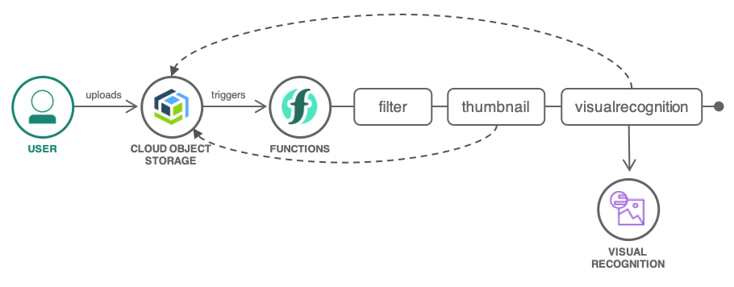
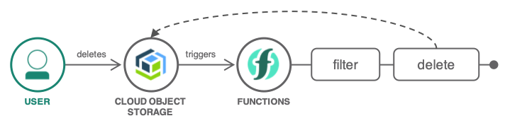

# Process images dropped into a Cloud Object Storage bucket with Cloud Functions

[Cloud Functions](https://cloud.ibm.com/functions) can be extended by [integrating with Cloud Object Storage](https://cloud.ibm.com/docs/openwhisk?topic=cloud-functions-pkg_obstorage). The COS trigger type lets you run custom code logic when a new object is stored, updated, or deleted from a designated bucket in COS. 

This project shows a very common use for this type of trigger. Whenever an image file is uploaded to a [Cloud Object Storage](https://www.ibm.com/cloud/object-storage) bucket, a sequence of actions will generate a thumbnail for the image (a smaller version) and will use IBM Cloud Visual Recognition to identify objects, places, faces from the original image.

1. The user uploads an image to the Cloud Object Storage bucket.
1. Cloud Object Storage sends an event to Cloud Functions.
1. This event triggers a sequence of actions:
   1. A thumbnail is generated and stored under the `thumbnails/` prefix in the bucket.
   1. Visual Recognition is called on the image and the results stored under the `metadata/` prefix in the bucket.

1. The user deletes an image.
1. Cloud Object Storage sends an event to Cloud Functions.
1. The event triggers the delete action to remove the generated thumbnail and visual recognition metadata.

## Actions

| *Name* | *Runtime* | *Description* |
| --- | --- | --- |
| on-create | Sequence | Called when files are written to Cloud Object Storage. |
| filter | Node.js | Ignores non-image files and events generated by the thumbnails or visual recognition files. |
| thumbnail | Node.js | Uses [gm](https://aheckmann.github.io/gm/) to generate thumbnails from images stored in [Cloud Object Storage](https://github.com/IBM/ibm-cos-sdk-js). |
| visualrecognition | Node.js | Analyzes images with [Visual Recognition](https://github.com/watson-developer-cloud/node-sdk#visual-recognition) and stores the results in the bucket. |
| on-delete | Sequence | Called when files are deleted from Cloud Object Storage. |
| delete | Node.js | Removes thumbnails and visual recognition files. |

## Triggers

| *Name* | *Trigger Type* | *Description* |
| --- | --- | --- |
| on-create | Cloud Object Storage | Called when files are added to the bucket |
| on-delete | Cloud Object Storage | Called when files are deleted from the bucket |